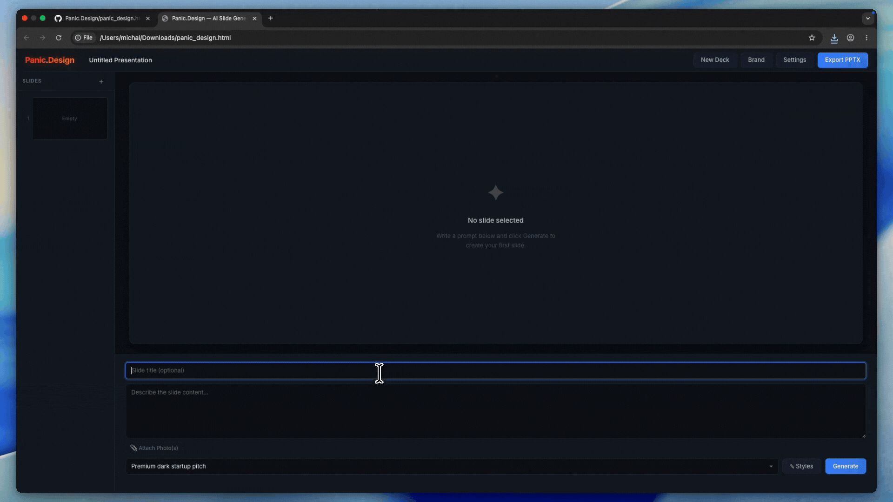

# Panic.Design

> **15 minutes until your pitch. Blank screen. Total panic. We've got you covered.**

Panic.Design is a break-glass-in-case-of-emergency AI presentation generator. When you don't have time to tweak font weights, adjust bounding boxes, or sign up for a new $10/month SaaS subscription, this tool instantly generates visually stunning, complete .pptx decks from a single text prompt.

**Zero dependencies. Zero backend. Zero subscriptions. One single HTML file.**

---

## Features

* **Instant Generation:** Type your frantic thoughts, select an emergency vibe (e.g., "Save-My-Job Corporate"), and get a presentation-ready slide.
* **Context-Aware Vision:** Attach reference images. The app automatically downscales them and feeds them to the vision model to maintain your specific visual context.
* **Coherent Deck Flow:** Previously generated slides are used as visual context so new slides can better match the deck’s style, density, palette, and layout direction.
* **Frictionless UI:** Smooth dark mode, drag-and-drop slide reordering, draft generation states, and custom scrollbars. 
* **Bring Your Own Key (BYOK):** Plug in your own OpenRouter API key. You pay for exactly what you use, directly to the AI provider.

---

## The Engineering Flex (Under the Hood)

In a world of bloated Next.js boilerplates and endless `node_modules`, Panic.Design is a radically minimalist frontend application. The entire application exists inside a single `panic_design.html` file.

* **Native .pptx Export (Zero Libraries):** We didn't use JSZip or PptxGenJS. We wrote a custom, pure-vanilla JavaScript ZIP packager with raw crc32 hashing and Uint8Array byte manipulation to dynamically construct Microsoft PowerPoint XML files natively in the browser.
* **Local Key Encryption:** API keys never touch a backend server, because there is no backend. They are encrypted locally in your browser using the native Web Crypto API via **AES-GCM encryption**.
* **Local-First State:** All presentation drafts, slide data, and user preferences are persisted entirely client-side using **IndexedDB**. 
* **Smart Token Optimization:** Attached reference photos are instantly drawn to a hidden HTML5 canvas, resized to a maximum of 512px, and converted to base64 to save your API tokens before ever making a network request.

---

## How to Run

No build steps. No npm installs. No local servers required.

1. Clone or download this repository.
2. Double-click the `panic_design.html` file to open it directly in your browser.
3. **Configure your API Key:** Panic.Design is a BYOK (Bring Your Own Key) tool. You must provide your own OpenRouter API key to generate slides. Click **Settings** in the top navigation, paste your OpenRouter key, and choose your storage security preference.
4. Write your prompt, hit generate, and export to .pptx.

*(Note: Depending on your specific browser's strict security flags regarding the file:// protocol, advanced features like Web Crypto API encryption might occasionally require running via a standard local server, but the app is designed to work natively via double-click in standard desktop environments).*

---

## Hackathon Context

This project was built for the **DeveloperWeek New York 2026 Hackathon**. 

It specifically targets the **name.com Domain Roulette** challenge, built directly around the domain: `panic.design`. The concept of "panic" dictates the entire workflow: it bypasses the slow, tedious process of micro-editing layouts by generating complete, beautifully finalized slides instantly. It is built from the ground up to solve the exact problem of a looming, last-minute deadline.

---

## License

MIT License. Use it, fork it, remix it, and ship something cool.